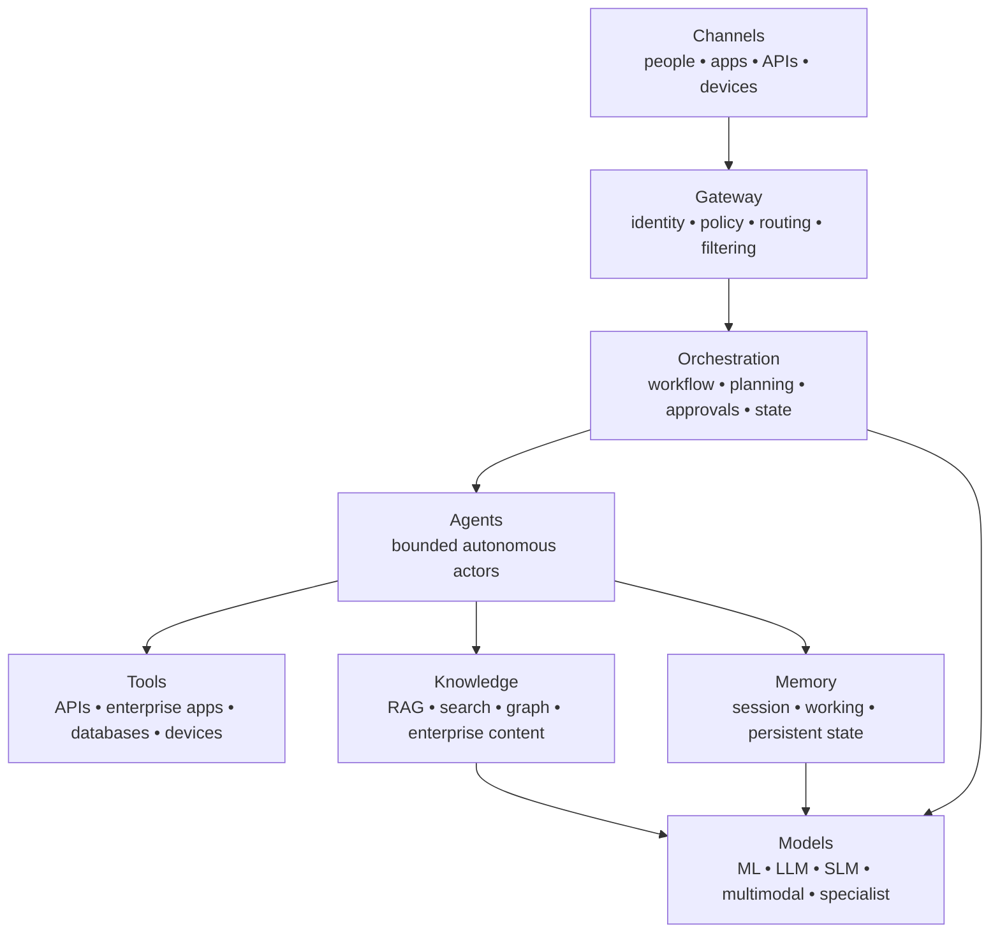

# Enterprise AI Reference Architecture — CGOATKMM

This is a reasoning aid, not a requirement to deploy eight layers.

## SGOE surrounds the stack
**Security** protects identities, data, models, agents, tools and infrastructure.  
**Governance** defines accountability, policy, risk tolerance and human authority.  
**Observability** exposes prompts, retrieval, tool calls, latency, failures and cost.  
**Evaluation** measures quality, grounding, task success, safety and business outcomes.

## Rule
Start with the minimum required layers. Increase autonomy only when its expected value exceeds the added operational and security risk.
